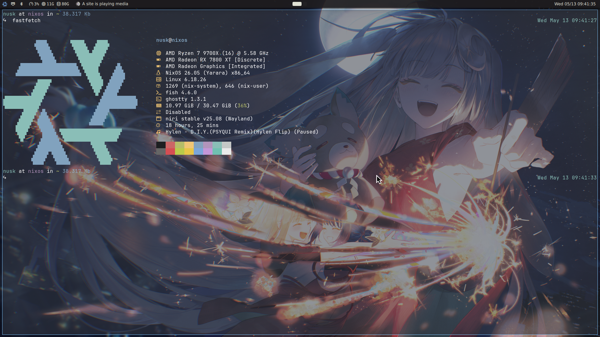

# NixOS desktop: niri + noctalia-shell



Flake-based NixOS configuration for two hosts (`laptop`, `desktop`), single user (`nusk`).

| Component        | Choice                                                                 |
| ---------------- | ---------------------------------------------------------------------- |
| Compositor       | [niri](https://github.com/YaLTeR/niri) (scrollable tiling Wayland)    |
| Shell / bar      | [noctalia-shell](https://github.com/noctalia-dev/noctalia-shell)       |
| Terminal         | [Ghostty](https://ghostty.org)                                         |
| Editors          | Zed, Vim                                                               |
| Browsers         | Vivaldi, Google Chrome                                                 |
| Launcher         | vicinae                                                                |
| File manager     | Dolphin                                                                |
| Display manager  | SDDM (Wayland, pixel_sakura theme)                                     |
| Audio            | PipeWire                                                               |
| Input method     | fcitx5 + mozc                                                          |
| Secure Boot      | [lanzaboote](https://github.com/nix-community/lanzaboote) v1.0.0      |
| Gaming           | Steam + Proton-GE                                                      |
| VR               | WiVRn + xrizer + wayvr                                                 |

## Layout

```
flake.nix
system/
  laptop/
    configuration.nix        # boot, networking, pipewire, portals, fcitx5, sddm
    hardware-configuration.nix
  desktop/
    configuration.nix        # same as laptop + lanzaboote, steam, wivrn
    hardware-configuration.nix
home/
  laptop/
    default.nix              # entrypoint, session vars
    programs.nix             # vivaldi, chrome, vim, zed, ghostty
    niri.nix                 # keybinds & layout
    noctalia.nix             # bar
    ghostty.nix / fish.nix / git.nix / gtk.nix / qt.nix
  desktop/
    default.nix
    programs.nix
    niri.nix
    noctalia.nix
    fastfetch.nix / ghostty.nix / fish.nix / git.nix / gtk.nix / qt.nix
```

## Usage

`nixos-rebuild switch` applies both system and home-manager changes (HM runs as a NixOS module).

```sh
sudo nixos-rebuild switch --flake .#laptop    # on the laptop
sudo nixos-rebuild switch --flake .#desktop   # on the desktop
```

Update inputs:

```sh
nix flake update                        # bump all inputs
nix flake lock --update-input niri      # bump one input
```

## Keybinds (niri)

| Bind                  | Action                             |
| --------------------- | ---------------------------------- |
| `Mod+Return`          | ghostty                            |
| `Mod+W`               | vivaldi                            |
| `Mod+Shift+W`         | google-chrome                      |
| `Mod+Z`               | zed                                |
| `Mod+E`               | dolphin                            |
| `Mod+D`               | vicinae launcher                   |
| `Mod+Q`               | close window                       |
| `Mod+Shift+E`         | quit niri                          |
| `Mod+H/L`             | focus column left/right            |
| `Mod+J/K`             | focus window down/up               |
| `Mod+Shift+H/L`       | move column to monitor left/right  |
| `Mod+Shift+J/K`       | move column right/left             |
| `Mod+Left/Right`      | focus monitor left/right           |
| `Mod+1..9`            | focus workspace                    |
| `Mod+Shift+1..9`      | move column to workspace           |
| `Mod+R`               | cycle preset column width          |
| `Mod+F`               | maximize column                    |
| `Mod+Shift+F`         | fullscreen window                  |
| `Print` / `Mod+Sh+S`  | screenshot (area)                  |
| `Ctrl+Print`          | screenshot (screen)                |
| `Alt+Print`           | screenshot (window)                |
| `Mod+Ctrl+L`          | lock screen                        |
| `Mod+P`               | session menu                       |
